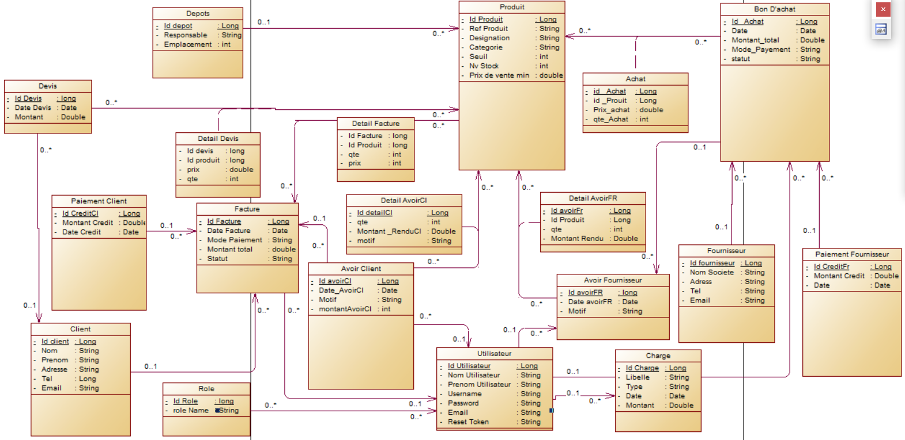
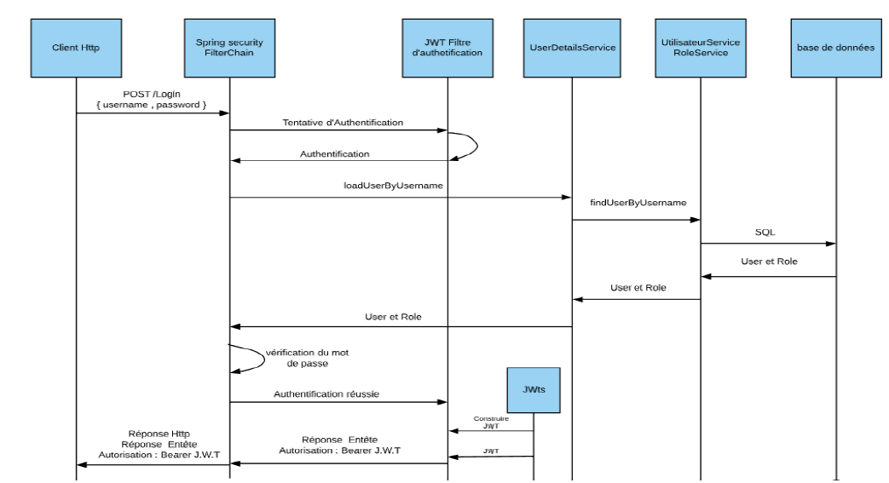
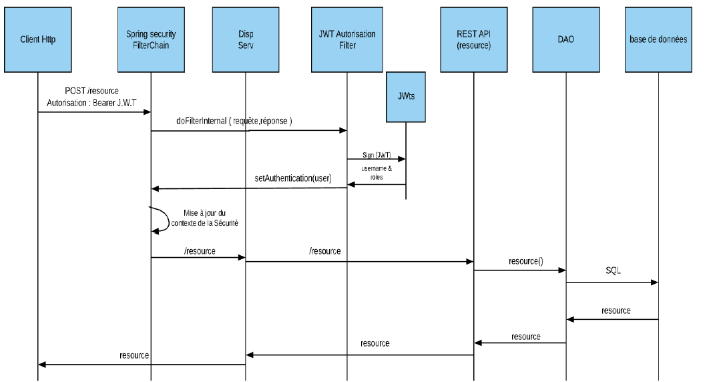
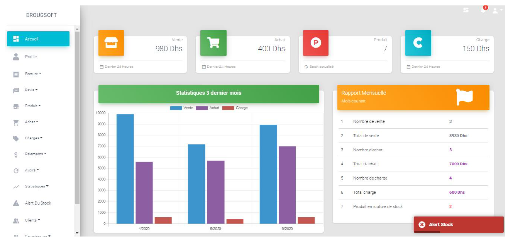
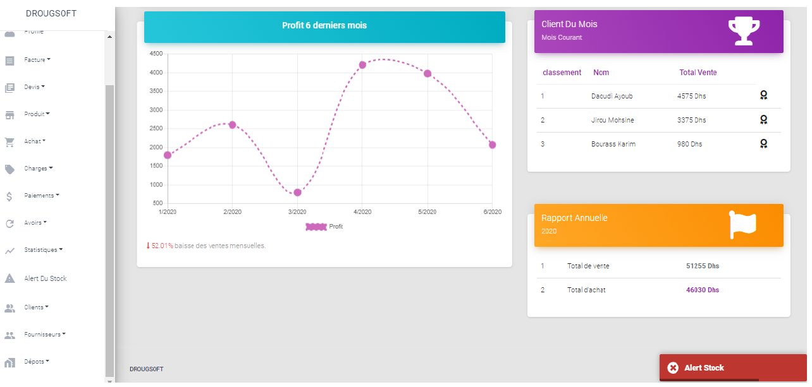
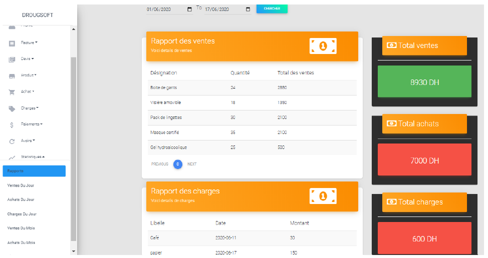

# Projet Fin d'Année

Ce projet a été réalisé dans le cadre du projet de fin d'année a l'ENSA d'Aagadir .

Cette repo contient la partie back end, pour voir la partie front end
Front end : https://github.com/KarimBourass/DrogSouft-FrontEnd

## Diagramme de classe 

## Security
La couche est responsable de gérée le côté sécurité dans l’application.

### Authentication Spring Security avec JWT

### La demande d'une ressource qui nécessite l'authentification

Les mots de passe sont codés à l'aide de BCrypt.

## DashBoards :

